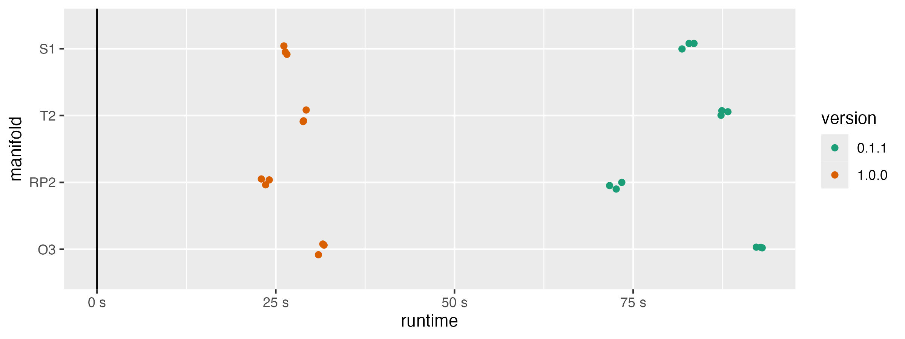

Our goal with the TDAverse is to provide a stable, accessible, and extensible R package collection for topological data analysis.
We have especially in mind non-specialist users like data analysts and scientists who see a role for persistent homology (PH) in their projects but haven't the background or the bandwidth to adapt low-level implementations of essential algorithms into their workflows.
In previous blog posts we've described an efficient common data structure and general-purpose toolboxes for statistical inference and machine learning; but all of this infrastructure depends on users' ability to efficiently compute PH.

Concluding our sponsored work is an upgrade to the R package {ripserr}.
This is a lightweight wrapper around Ulrich Bauer's `Ripser` library [@Bauer2021], still perhaps the fastest implementation of PH using the Vietoris–Rips (VR) filtration.
{ripserr} uses {Rcpp} to bind this C++ engine, as well as the cubical PH engine `Cubical Ripser` employing the same design principles [@Kaji2020], to R.

## Past

`Ripser` was first first released in 2016, but it went through several upgrades before being described in the celebrated journal article [@Bauer2021].
Bauer itemizes four tactics used to reduce computation time:

1. Leverage the nilpotency of the boundary operator ($\partial^2 = 0$, key to the definition of homology) to clear trivial cycles from the matrix reduction procedure [@Chen2011].
2. Use the clearing step of (1) in the calculation of persistent _cohomology_ rather than homology [@deSilva2011], which turns out to be much faster especially for low homological degree (the vast majority of practical use cases).
3. Rather than construct and store complete coboundary matrices to be reduced, construct specific columns as needed to perform the reduction steps. As with the use of cohomology, the runtime savings of this memory-reduction trick were unexpected.
4. Omit from the implicit matrix reduction procedure in (3) the pivots corresponding to a type of persistence pairs that can be locally determined, hence very efficiently computed.

In 2018, @Wadhwa2019a coupled the then-current "short" version of `Ripser` to the multi-purpose package {TDAstats}, and later into the slim {ripserr} package [@Wadhwa2025].
A subsequent release additionally included the `Cubical Ripser` library of @Kaji2020, of which we'll say a bit more at the end.

## Present

The upgrade to {ripserr} v1.0.0 was straightforward:[^v0.3.0]
We plopped the current "main" version of `Ripser` into where the previous version had been, reconfiguring the {Rcpp} infrastructure along the way.[^forks]
This brought two immediate improvements: a modest increase in efficiency, and proper encodings of deaths at infinity.

[^v0.3.0]: While we draw comparisons to v0.1.1, we published one minor update v0.3.0 with many new features independent of the source code upgrade and another v0.4.0 with a new data set. This was done in order to ensure that the features would be tested between the old and new source code and differences would be caught that might have been missed.
[^forks]: To resolve unexpected issues and simplify the commit history, exploratory work was done in several new forks and consolidated in [the `ripserq` branch of a new `Ripser` fork](https://github.com/corybrunson/ripser/tree/ripserq).

```{r setup}
library(ripserr)
packageVersion("ripserr")
```

Below is a comparison of {ripserr} runtimes to compute degree-2 persistent homology on uniform samples of size 840 from 4 embedded manifolds: the circle $\mathbb{S}^1$, the torus $\mathbb{T}^2$, the real projective plane $\mathbb{RP}^2$, and the orthogonal matrix group $O(3)$.
This is not an exhaustive comparison—many real-world data sets will be much larger and higher-dimensional—but it illustrates a practical improvement of the upgrade:
The efficiency gains are substantial, reducing runtimes by about 2/3 across all shapes.
The v0.1.1 runtimes might even be advantaged by having used the implementation on the `short` branch of the `Ripser` repo; we changed to the main library to clear the way for several future upgrades described below.

::: {#fig-benchmark}

:::

One source of confusion with the previous version of {ripserr} was that persistent pairs whose deaths exceeded the `threshold` limit, including the one pair with death at infinity, were omitted from the output.
This was ultimately a limitation of the shortened Ripser code used to originate the package so could only be resolved by updating the source.
Below is an example of the new behavior:

:::: {.columns}
::: {.column width="50%"}

```{r infinite threshold}
UScitiesD |> 
  vietoris_rips(threshold = Inf) |> 
  as.data.frame()
```

:::
::: {.column width="50%"}

```{r finite threshold}
UScitiesD |> 
  vietoris_rips(threshold = 800) |> 
  as.data.frame()
```

:::
::::

The unbounded results are unchanged from v0.1.1, except that the feature with infinite death, representing the connected component formed at sufficiently large scales, is included.
The results with bounded threshold additionally include features whose births subceed the threshold but whose deaths exceed it. Though note that the degree-1 component, not yet born at a radius of 800 miles, remains absent.

Unfortunately, it remains ambiguous which deaths are censored by the threshold versus truly infinite; [the `missing-r` deveopment branch](https://github.com/tdaverse/ripserr/tree/missing-r) solves this problem for now, though the next update will hopefully include a more elegant solution.
In the upcoming output, the `death` column distingishes between those of unknown scale (`NA`) and the complete connected component (`Inf`).

## Future

Several upgrades are in the works and fall into three bins: continuations of the recent source code upgrade, analogous upgrades to `Cubical Ripser`, and miscellaneous new R-side features.

Continuing recent work, we are interested to switch the distance measurement type from floats to doubles, enabling greater precision and matching user expectations of R at minimal computational cost, though this will require some careful testing.
Another interest is to make available coefficients other than $\mathbb{Z}/2\mathbb{Z}$. The parameter `p` has been with the package from the beginning but does not affect the compiled source; we plan to provide multiple compilations with the package so that the efficiency gains of binary remain available.
Finally, we will adapt code from alternate branches of `Ripser` to collect representative cocycles and cycles along the computation, which will dramatically expand the potential utility of the package.

The change from float to double and the collection of representative (co)cycles are also planned for a future upgrade to the `Cubical Ripser` code.
Additionally, the somewhat artificial limits on array dimensions, imposed on the source code and pre-empted by data checks on the R side, will be revised or, if possible, removed in favor of R-side warnings and optional user-specified limits.
As computational resources and perhaps algorithmic efficiency improve, this will allow users to deploy `Cubical Risper` on more diverse image datasets subject to their own size limits.

Strictly on the R side, recent changes to the development version on GitHub allow `cubical()` to perform superlevel as well as sublevel set filtrations, by way of an internal transformation of the array data (and using the same parameter, `sublevel` with default `TRUE`, as `TDA::gridDiag()`).
`cubical()` can also now handle 1-dimensional arrays by coercion to matrices and passage to the source code for 2-dimensional rasters.
Meanwhile, `vietoris_rips()` now accepts multivariate, not only univariate, time series, and the dimensionality of the sliding window embedding [@Perea2015; @Umeda2017] defaults more naturally to the period, if one is available, rather than to 2.
Some syntax is scheduled to change, but when the time comes existing parameters will only be soft-deprecated.

As ever, we welcome user feedback on every front!
